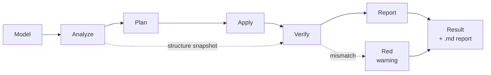

<div align="center">

# Tanyra3D

**A 3D model optimizer for the web that tells you what it did — and why.**

[](LICENSE)
[](https://nodejs.org/)
[](#status)
[](#install)

Drop in a `.glb`, tick the boxes you want, get a smaller model back — along with a
report in plain language: what was found, what was applied, what was left alone, and
for what reason.

**Nothing happens silently.**

<br>

### [⬇ Download the app — Windows · macOS · Linux](https://github.com/GlukerR/Tanyra3D/releases/latest)

An ordinary application. No Node.js, no terminal, nothing to configure.
The first launch shows a warning — [why, and what to click](#install).

Want what is being worked on right now? The
[preview builds](https://github.com/GlukerR/Tanyra3D/releases) are on the releases page,
marked **Pre-release**.

<br>

[Русская версия](README.ru.md)

</div>

---

## What it actually does

One run, real numbers, no flags and no configuration:

```
$ node optimize2.mjs

phase 3/5 · apply · basic (8 fixes)
  • Duplicate resources (dedup)   • Vertex weld
  • Unused resources (prune)      • Degenerate triangles
  • Mesh join (flatten + join)    • Geometry compression

phase 4/5 · validation
  [baseline-validate] triangles: 7500 → 7500
  [baseline-validate] drawCalls: 1 → 1
  [baseline-validate] skins: 0 → 0    animations: 0 → 0

[DONE] Instance Grid 01.glb: file 0.95 → 0.19 MB (−80%)
```

Five times smaller. Triangles, draw calls, skins and animations all intact — and that
is not a promise but a check: the engine compared the result against a snapshot taken
before the work started.

---

## How this differs from `gltf-transform optimize`

The stock `gltf-transform optimize` command enables mesh simplification and texture
downscaling by default. For a product catalog or a portfolio that is unacceptable: the
model somebody paid for comes back coarser than it went in.

Two things are different here.

### Everything is off by default

An empty list of optimizations means the file is read, validated and written back
without a single change. Each optimization is enabled explicitly and comes with an
honest description: what it does, whether it is reversible, whether data is lost, and
whether the target site needs a decoder for it.

### The result is verified, not assumed

After processing, the engine compares the model against a snapshot taken beforehand:
triangles, vertices, draw calls, skins, animations, morph targets, attribute set.

If anything drifted, a **red warning** appears at the top listing the differences, and
the report explains what broke. The file is still written and can still be downloaded —
whether the result is good enough is the human's call, not the tool's.

> Quietly handing back a broken model whose damage isn't visible to the eye is the one
> thing this tool will not do.

---

## What it can do

| Optimization | What it does | Data loss | Decoder needed on site |
|---|---|---|:---:|
| **safe** | Deduplicate materials and textures, drop unused data and UV channels, weld matching vertices, cut degenerate triangles | none | no |
| **join** | Merge meshes — fewer draw calls | none, but parts stop being separate objects | no |
| **instance** | Repeated meshes → GPU instancing | none | no |
| **meshopt** | Geometry compression | none | yes |
| **draco** | Geometry compression, stronger and slower | none | yes |
| **quantize** | Pack geometry numbers tighter | barely visible | **no** |
| **ktx2** | Textures to KTX2: saves both download and video memory | barely visible | yes |
| **webp** | Textures to WebP | barely visible | no |
| **resample** | Thin out redundant animation keyframes | none | no |
| **strip-colors** | Remove vertex colors | **yes**, opt-in only | no |

None of them changes the polygon count. Mesh simplification is deliberately absent.

<details>
<summary><b>Why instancing gets ticked automatically</b></summary>

<br>

`instance` turns itself on when shared geometry is found — several nodes pointing at one
mesh. This isn't only about saving draw calls.

`join` has to bake each node's transform into the vertices, which means **multiplying
shared geometry into copies**. Nodes carrying instancing it doesn't touch at all. On the
chess set from the Khronos reference models, the difference between "join without
instancing" and "with it" is **75.5 MB versus 41.0 MB** for the same draw-call result.

</details>

---

## How it works



Every optimization is a self-contained rule carrying its own metadata: how serious the
finding is, whether the fix is provably safe, whether it is reversible, which data it
touches, which other rules must run first. The engine builds the order itself and
decides what to apply: anything up to "invisible to the eye" runs automatically, while
anything lossy requires an explicit opt-in.

The core (`core/`) knows nothing about glTF. Everything format-specific lives in an
add-on (`addons/gltf/`). That split exists for the sake of a second format, not for
elegance.

---

## Install

### The app — an ordinary program, no terminal

Download your file from the [releases page](https://github.com/GlukerR/Tanyra3D/releases)
and run it. No Node.js, no commands, and the texture encoder is already inside.

The download button above always points at the tested build. Releases marked
**Pre-release** on that page are the new things being tried out — take one if you want
what is being worked on right now, and expect rough edges.

| System | File |
|---|---|
| Windows | `Tanyra3D-…-windows-x64.exe` |
| macOS (Apple Silicon — any Mac from late 2020) | `Tanyra3D-…-macos-arm64.dmg` |
| Linux | `Tanyra3D-…-linux-x86_64.AppImage` or `.deb` |

> [!IMPORTANT]
> **The first launch will show a warning.** The app is not code-signed: a certificate
> costs money every year and this is a non-commercial project. The warning does not say
> "this program is dangerous" — it says "the system does not know this publisher".

<details>
<summary><b>Getting past the warning</b></summary>

<br>

**Windows.** The blue "Windows protected your PC" screen → **More info** →
**Run anyway**.

**macOS.** A double-click will say the app cannot be verified. Dismiss it,
**right-click the icon** → **Open** → **Open** again in the next dialog. If that entry
is missing: **System Settings** → **Privacy & Security**, where a line about Tanyra3D
and an **Open Anyway** button will be waiting. Once per version.

**Linux.** An AppImage needs permission to run — right-click → **Properties** →
**Permissions** → "Allow executing file as program". Or: `chmod +x Tanyra3D-*.AppImage`.
The `.deb` installs the usual way and asks nothing.

</details>

If you would rather not trust a downloaded binary, build it yourself — the source is here.

### From source

You need [Node.js](https://nodejs.org/) 20.9 or newer. Works on Windows, macOS and Linux.
(The app above needs none of this — this section is for running from source.)

```bash
git clone https://github.com/GlukerR/Tanyra3D.git
cd Tanyra3D
npm install
npm run setup
```

Then `npm start` and the program opens at `http://localhost:3210`. That is the whole of it —
four lines and no decisions to make.

`npm install` pulls everything installable from npm, including the texture encoding CLI.
`npm run setup` checks your environment and offers to install the one thing npm cannot.
Neither downloads a browser: the tests need one, the program does not.

> The lines are separate on purpose. Joining them with `&&` fails on **Windows PowerShell
> 5.1**, which is still what a fresh Windows 10 or 11 gives you — `&&` arrived in PowerShell
> 7, a separate install. Four lines work in every shell.

<details>
<summary><b>Windows: "npm.ps1 cannot be loaded because running scripts is disabled"</b></summary>

<br>

Nothing is wrong with the project. Windows ships with PowerShell script execution turned
off, and npm's PowerShell wrapper is a script. **Use `npm.cmd` instead — same npm, no
settings to change:**

```
npm.cmd install
```
```
npm.cmd run setup
```
```
npm.cmd start
```

The other way is to allow signed scripts for your own account, which is Microsoft's
documented remedy and affects everything you run in PowerShell, not just this project:

```
Set-ExecutionPolicy -Scope CurrentUser RemoteSigned
```

That is a change to a Windows security setting. It is yours to make — the project does not
need it, and `npm.cmd` gets you to the same place without touching anything.

Command Prompt (`cmd.exe`) and PowerShell 7 are not affected either way.

</details>

**You do not need to run the tests to use this.** They exist for people changing the code;
if that is you, see [Tests](#tests) below.

<details>
<summary><b>What <code>npm run setup</code> does</b></summary>

<br>

```
Tanyra3D — environment check

  ✓ Node 20.11.0
  ✓ Dependencies installed
  ✓ Texture encoding tool (@gltf-transform/cli)
  • KTX2 encoder not found — KTX2 texture compression unavailable
    Everything else works without it.
    Download and install KTX-Software 4.4.2 from the official Khronos release? [y/N]
```

There is exactly one thing npm cannot install: `ktx` from **KTX-Software**, a native
Khronos program. The script offers to fetch it from the official Khronos release — and
only after you say yes. Answer no and it prints how to install it yourself; nothing else
changes.

How it installs depends on what Khronos publishes for your system. On **Linux** there is
an unpackable archive, so it lands inside the project (`.tools/`) with no administrator
rights and its checksum is verified. On **Windows and macOS** only installers are
published, so the official installer runs and your system asks for confirmation the usual
way. Those two have no checksum published alongside them; the download is over HTTPS from
`github.com`, which is what actually protects it.

Run `npm run doctor` any time to re-check without changing anything, and
`npm run setup -- --yes` to skip the question in a script. Without a TTY — in CI, or
through a pipe — the question is never asked, so nothing can hang waiting for an answer.

Without `ktx`, everything except KTX2 compression works normally, and KTX2 says plainly
that the tool is missing instead of failing obscurely.

</details>

---

## Three ways to run it

### Web interface

```bash
npm start
```

Opens `http://localhost:3210`. Drag in a model, pick a target platform, tick the
optimizations, press **Build optimized model**. Source on the left, result on the right,
before/after numbers and the report in between. The model plays in both viewports at
once, sharing camera and animation time.

Everything runs locally. Models are never uploaded anywhere.

### Command line

```bash
node optimize2.mjs                          # preset: safe + meshopt + join
node optimize2.mjs draco                    # same, Draco instead of Meshopt
node optimize2.mjs --keep-parts             # without merging meshes
node optimize2.mjs --ktx2                   # add texture compression
node optimize2.mjs --ktx2 --etc1s           # ...with lighter, coarser color textures
node optimize2.mjs --dry-run                # full analysis and report, writing nothing
node optimize2.mjs --passthrough            # apply nothing, just validate
```

Input comes from `input/`, results and an `name.report.md` land in `output/`. The whole
folder is processed at once — that is the batch mode; the web interface handles one
model at a time.

> [!NOTE]
> On the command line, running without flags applies a preset rather than a passthrough.
> That's historical, and the behaviour is preserved so existing scripts don't break. The
> programmatic and web interfaces do nothing by default.

> [!IMPORTANT]
> **Changed:** `--ktx2` without a mode flag now produces UASTC color textures. It used to
> produce ETC1S — the command line disagreed with the web interface, which has always used
> UASTC, and nothing said so. Files come out heavier and sharper than before. Add `--etc1s`
> to keep the old result.

### Programmatic

Five exports, and they fit on one screen:

```js
import {
  optimizeFile,   // run the pipeline over a file
  inspectFile,    // metadata + validation, changing nothing
  exportJson,     // the asset as self-contained JSON
  listRules,      // every rule and everything it declares about itself
  VERSION,
} from './optimize2.mjs';
```

**Optimizing:**

```js
const result = await optimizeFile('model.glb', {
  advancedFeatures: ['safe', 'draco'],
  outDir: 'output',
});

console.log(result.status);              // 'ok' | 'fail'
console.log(result.metrics.before, result.metrics.after);
console.log(result.applied);             // what was actually applied
console.log(result.validation);          // validation results
```

**Analyzing without touching anything.** Two ways, and they answer different questions.
`inspectFile` reads the asset as it is; `dryRun` runs the whole pipeline and reports what
*would* happen, writing no file:

```js
await inspectFile('model.glb');          // { format, asset, extensions, metadata, validation }

const preview = await optimizeFile('model.glb', {
  advancedFeatures: ['safe', 'ktx2'],
  dryRun: true,                          // full analysis and report, nothing written
});
preview.findings;                        // what was found
preview.skipped;                         // what was not done, and why
```

**Asking what the engine can do.** `listRules()` returns each rule's full declaration —
enough to build an interface from, which is what the web interface does:

```js
listRules()[0];
// {
//   id: 'structure/dedup', category: 'materials', severity: 'info',
//   tier: 'basic', feature: 'safe', fixSafety: 'provable',
//   reversible: true, dataLoss: 'none', runAfter: [], touches: [...]
// }
```

`fixSafety` says how well the safety of the fix can be proven, `dataLoss` and `reversible`
say what it costs. Nothing about a rule is hidden from the caller.

The full contract is in [`docs/ARCHITECTURE.md`](docs/ARCHITECTURE.md) §4b.

---

## Tests

For people changing the code. If you only want to use the program, skip this section — the
tests take about ten minutes and tell you nothing you need.

```bash
npm run setup -- --tests
npm test
```

The first line adds the browser some tests drive — a few hundred megabytes, which is why it
is not part of the ordinary install. Without it: `npm test -- --project node`.

The tests are integration tests: real models through the real pipeline, no mocks.

The repository ships a small corpus of models built specifically for testing — a
deliberately dirty cube, a grid of linked duplicates, unlinked copies of one mesh
without normals, morph targets, vertex colors, already-compressed input, an
already-instanced scene, a scene with no geometry, a file that is nothing but textures,
two scenes in one file, a deliberately truncated file. Enough for the suite to be green
straight after cloning.

Tests that need heavier models are reported as skipped with the reason stated — visible
in the run output rather than dissolved into silence.

---

## Limitations

The honest list of what the tool doesn't do, or doesn't do fully.

- **Animation and skin verification is by count.** The engine makes sure clips and skins
  don't disappear, but doesn't compare their contents frame by frame. You can check by
  eye in the viewer.
- **`meshopt` on characters with morph targets** can corrupt skinning. The pipeline
  detects this and flags the result with a red warning — the file is written, but don't
  trust it; use `draco` instead.
- **Texture dimensions are measured and compared, but not fixed.** The largest side is
  read from the image header (PNG, JPEG, WebP, KTX2) and checked against the platform
  threshold. Downscaling an oversized texture is a separate opt-in — the tool never
  discards pixels on its own.
- **Two engines, three store targets.** The viewer renders through three.js or
  model-viewer; the targets are Shopify, VNTANA and the Google Merchant Center 3D
  listing, each with numbers taken from that platform's own documentation. A target is
  an ADDRESS a model is sent to, not a class of device: the "mobile" and "Quest"
  profiles were deleted on 2026-08-18 because a phone browser and a headset browser are
  the same three.js, and their numbers were never confirmed by a primary source.
- **Batches are built one model at a time, in sequence.** Drop a folder or fifty files,
  tick the ones you want, press build: the models are processed one after another, and
  the viewport shows whichever is being worked on. Nothing runs in parallel — one
  ABeautifulGame costs 704 MB of video memory, and fifty at once would take the tab down.
  When the batch is done, one table answers what fifty separate reports cannot: what each
  model weighed before and after, which ones sit over the target's limit, which failed.
  It computes nothing of its own — every number is read back from the per-model reports —
  and saves as CSV.

---

## Status

**0.2.5 — a target need not name an engine.** A target profile may leave `engine` empty,
and then it fits any engine — the way an empty engine field means "no preference". Two
new targets ship with numbers from their own documentation: VNTANA (which rejects Draco
outright, so the option is subtracted rather than warned about) and the Google Merchant
Center 3D listing. The "mobile" and "Quest" profiles are gone: a device class is not an
address. A checkbox that is shown now always acts — a failed image decode is reported as
a failure instead of being passed off as "nothing to flatten".

**0.2.4 — a new viewing interface.** A shelf of icons instead of a growing toolbar: the
model's own properties — detail levels, view, cameras, lights, animation — each open
their own shelf. Lights and cameras authored in the file are shown rather than replaced
by ours, orthographic cameras included.

**0.2.3 — pointer animation survives.** `KHR_animation_pointer` is neither dropped nor
broken by the optimizations, and it plays in both viewports. The rule behind it: the
result is compared against the original file, not against an intermediate document, so an
unfamiliar extension survives passthrough, optimization and KTX2 alike.

**0.2.2 — a target of your own, and order on disk.** A target now subtracts options: an
unchecked box means "this target does not read that", and the option disappears from the
panel entirely. Targets are shared as a file — "Open a file…" and "Save to a file".
Texture sizes larger than the model's largest texture are no longer offered: the program
never enlarges, and a button that does nothing only confuses. And the work folder stopped
growing unnoticed — a ceiling by size, cleanup on quit, and the space used is shown in
the settings.

**0.2.1 — skinning fixes, texture resizing, your own target.** Four validator findings
about skinning are now repaired rather than reported; textures can be brought down to
4096/2048/1024/512 on the longer side; the core measures texture dimensions, so a target's
texture threshold finally has something to compare against; and a target of your own is
created from the settings window — a name, an engine and a few numbers. The middle digit
stays at 2: it is reserved for the second engine (Babylon.js).

**0.2.0 — the sources are TypeScript.** Core, interface and viewer are compiled from
`.mts`/`.ts`; what the program does is what 0.1.1 did — the number records a change of
language, not of features. The test suite is green on Node 20, 22 and 24. The desktop
application installs like any other program — no terminal needed. The API may still change.

Installed and used on Windows. The macOS and Linux packages are built by CI from the same
source and pass the same checks, but nobody has run them on real hardware yet — if you do,
[say how it went](https://github.com/GlukerR/Tanyra3D/issues).

The browser is the current shape, not the intent. The people this is built for shouldn't
have to work through a hundred checkboxes or launch anything from a terminal: install in
one click, drop in a model, get a result with an explanation.

---

## Why this exists

Small studios and artists working alone face the same weight and compatibility
requirements as large teams — but without the person who translates those requirements
into plain language.

That person is what the program is meant to be.

---

## Documentation

| File | About |
|---|---|
| [`CONTRIBUTING.md`](CONTRIBUTING.md) | how to contribute |
| [`docs/ARCHITECTURE.md`](docs/ARCHITECTURE.md) | core design, API contracts |
| [`docs/EXTENDING.md`](docs/EXTENDING.md) | how to add your own rule |
| [`tests/TEST-MAP.md`](tests/TEST-MAP.md) | the five test layers, and where a new test goes |
| [`fixtures/README.md`](fixtures/README.md) | the model corpus and its license policy |
| [`ui/locales/README.md`](ui/locales/README.md) | how to add an interface language |

Everything on the contributor's path is in English. The project grew up in Russian, so the
code comments and some reference documents under `docs/` still are — translating them is
welcome work, and a good first contribution.

---

## Contributing

Patches are welcome — start with [`CONTRIBUTING.md`](CONTRIBUTING.md). It's short: five
principles, each of which was introduced after breaking it cost somebody time.

## License

[Apache-2.0](LICENSE).

Models under `fixtures/models/` marked as redistributable were made by the project author
and fall under the same license. The one exception is `Unlinked Duplicates 01.glb`: its
geometry is Suzanne, the Blender mascot; the origin is noted in its `.license.md`. Other
models used during development are not included in the repository — each has its own
license.
