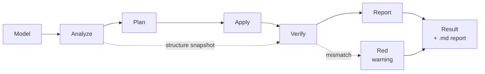

<div align="center">

# Tanyra3D

**A 3D model optimizer for the web that tells you what it did — and why.**

[](LICENSE)
[](https://nodejs.org/)
[](https://github.com/GlukerR/Tanyra3D/releases/latest)
[](#install)
[](#status)

Drop in a `.glb`, tick the boxes you want, get a smaller model back — along with a
report in plain language: what was found, what was applied, what was left alone, and
for what reason.

**Nothing happens silently.**

<br>

### [⬇ Download the app — Windows · macOS · Linux](https://github.com/GlukerR/Tanyra3D/releases/latest)

An ordinary application. No Node.js, no terminal, nothing to configure.
The first launch shows a warning — [why, and what to click](#install).

Want what is being worked on right now? The
[preview builds](https://github.com/GlukerR/Tanyra3D/releases) are on the releases page,
marked **Pre-release**.

<br>

[Русская версия](README.ru.md)

</div>

---

## What it actually does

One run, real numbers, no flags and no configuration:

```
$ node optimize2.mjs

phase 3/5 · apply · basic (8 fixes)
  • Duplicate resources (dedup)   • Vertex weld
  • Unused resources (prune)      • Degenerate triangles
  • Mesh join (flatten + join)    • Geometry compression

phase 4/5 · validation
  [baseline-validate] triangles: 7500 → 7500
  [baseline-validate] drawCalls: 1 → 1
  [baseline-validate] skins: 0 → 0    animations: 0 → 0

[DONE] Instance Grid 01.glb: file 0.95 → 0.19 MB (−80%)
```

Five times smaller. Triangles, draw calls, skins and animations all intact — and that
is not a promise but a check: the engine compared the result against a snapshot taken
before the work started.

---

## How this differs from `gltf-transform optimize`

The stock `gltf-transform optimize` command enables mesh simplification and texture
downscaling by default. For a product catalog or a portfolio that is unacceptable: the
model somebody paid for comes back coarser than it went in.

Two things are different here.

### Everything is off by default

An empty list of optimizations means the file is read, validated and written back
without a single change. Each optimization is enabled explicitly and comes with an
honest description: what it does, whether it is reversible, whether data is lost, and
whether the target site needs a decoder for it.

### The result is verified, not assumed

After processing, the engine compares the model against a snapshot taken beforehand:
triangles, vertices, draw calls, skins, animations, morph targets, attribute set.

If anything drifted, a **red warning** appears at the top listing the differences, and
the report explains what broke. The file is still written and can still be downloaded —
whether the result is good enough is the human's call, not the tool's.

> Quietly handing back a broken model whose damage isn't visible to the eye is the one
> thing this tool will not do.

---

## What it can do

| Optimization | What it does | Data loss | Decoder needed on site |
|---|---|---|:---:|
| **safe** | Deduplicate materials and textures, drop unused data and UV channels, weld matching vertices, cut degenerate triangles | none | no |
| **resize** | Downscale textures to 4096 / 2048 / 1024 / 512 px on the longer side | **yes**, opt-in only | no |
| **join** | Merge meshes — fewer draw calls | none, but parts stop being separate objects | no |
| **instance** | Repeated meshes → GPU instancing | none | no |
| **meshopt** | Geometry compression | none | yes |
| **draco** | Geometry compression, stronger and slower | none | yes |
| **quantize** | Pack geometry numbers tighter | barely visible | **no** |
| **ktx2** | Textures to KTX2: saves both download and video memory | barely visible | yes |
| **webp** | Textures to WebP | barely visible | no |
| **resample** | Thin out redundant animation keyframes | none | no |
| **strip-colors** | Remove vertex colors | **yes**, opt-in only | no |
| **strip-dead-interactivity** | Drop clickable marks that no handler responds to | **yes**, opt-in only | no |
| **keep-unused-uv** | Keep a UV layout no image uses — for site configurators. Only the UV is kept; everything else unused is still cleaned away | none, the file grows by the UV itself | no |

None of them changes the polygon count. Mesh simplification is deliberately absent.

<details>
<summary><b>Why instancing gets ticked automatically</b></summary>

<br>

`instance` turns itself on when shared geometry is found — several nodes pointing at one
mesh. This isn't only about saving draw calls.

`join` has to bake each node's transform into the vertices, which means **multiplying
shared geometry into copies**. Nodes carrying instancing it doesn't touch at all. On the
chess set from the Khronos reference models, the difference between "join without
instancing" and "with it" is **75.5 MB versus 41.0 MB** for the same draw-call result.

</details>

---

## How it works



Every optimization is a self-contained rule carrying its own metadata: how serious the
finding is, whether the fix is provably safe, whether it is reversible, which data it
touches, which other rules must run first. The engine builds the order itself and
decides what to apply: anything up to "invisible to the eye" runs automatically, while
anything lossy requires an explicit opt-in.

The core (`core/`) knows nothing about glTF. Everything format-specific lives in an
add-on (`addons/gltf/`). That split exists for the sake of a second format, not for
elegance.

---

## Install

### The app — an ordinary program, no terminal

Download your file from the [releases page](https://github.com/GlukerR/Tanyra3D/releases)
and run it. No Node.js, no commands, and the texture encoder is already inside.

The download button above always points at the tested build. Releases marked
**Pre-release** on that page are the new things being tried out — take one if you want
what is being worked on right now, and expect rough edges.

| System | File |
|---|---|
| Windows | `Tanyra3D-…-windows-x64.exe` |
| macOS (Apple Silicon — any Mac from late 2020) | `Tanyra3D-…-macos-arm64.dmg` |
| Linux | `Tanyra3D-…-linux-x86_64.AppImage` or `.deb` |

> [!IMPORTANT]
> **The first launch will show a warning.** The app is not code-signed: a certificate
> costs money every year and this is a non-commercial project. The warning does not say
> "this program is dangerous" — it says "the system does not know this publisher".

<details>
<summary><b>Getting past the warning</b></summary>

<br>

**Windows.** The blue "Windows protected your PC" screen → **More info** →
**Run anyway**.

**macOS.** A double-click will say the app cannot be verified. Dismiss it,
**right-click the icon** → **Open** → **Open** again in the next dialog. If that entry
is missing: **System Settings** → **Privacy & Security**, where a line about Tanyra3D
and an **Open Anyway** button will be waiting. Once per version.

**Linux.** An AppImage needs permission to run — right-click → **Properties** →
**Permissions** → "Allow executing file as program". Or: `chmod +x Tanyra3D-*.AppImage`.
The `.deb` installs the usual way and asks nothing.

</details>

If you would rather not trust a downloaded binary, build it yourself — the source is here.

### From source

You need [Node.js](https://nodejs.org/) 20.9 or newer. Works on Windows, macOS and Linux.
(The app above needs none of this — this section is for running from source.)

```bash
git clone https://github.com/GlukerR/Tanyra3D.git
cd Tanyra3D
npm install
npm run setup
```

Then `npm start` and the program opens at `http://localhost:3210`. That is the whole of it —
four lines and no decisions to make.

`npm install` pulls everything installable from npm, including the texture encoding CLI.
`npm run setup` checks your environment and offers to install the one thing npm cannot.
Neither downloads a browser: the tests need one, the program does not.

> The lines are separate on purpose. Joining them with `&&` fails on **Windows PowerShell
> 5.1**, which is still what a fresh Windows 10 or 11 gives you — `&&` arrived in PowerShell
> 7, a separate install. Four lines work in every shell.

<details>
<summary><b>Windows: "npm.ps1 cannot be loaded because running scripts is disabled"</b></summary>

<br>

Nothing is wrong with the project. Windows ships with PowerShell script execution turned
off, and npm's PowerShell wrapper is a script. **Use `npm.cmd` instead — same npm, no
settings to change:**

```
npm.cmd install
```
```
npm.cmd run setup
```
```
npm.cmd start
```

The other way is to allow signed scripts for your own account, which is Microsoft's
documented remedy and affects everything you run in PowerShell, not just this project:

```
Set-ExecutionPolicy -Scope CurrentUser RemoteSigned
```

That is a change to a Windows security setting. It is yours to make — the project does not
need it, and `npm.cmd` gets you to the same place without touching anything.

Command Prompt (`cmd.exe`) and PowerShell 7 are not affected either way.

</details>

**You do not need to run the tests to use this.** They exist for people changing the code;
if that is you, see [Tests](#tests) below.

<details>
<summary><b>What <code>npm run setup</code> does</b></summary>

<br>

```
Tanyra3D — environment check

  ✓ Node 20.11.0
  ✓ Dependencies installed
  ✓ Texture encoding tool (@gltf-transform/cli)
  • KTX2 encoder not found — KTX2 texture compression unavailable
    Everything else works without it.
    Download and install KTX-Software 4.4.2 from the official Khronos release? [y/N]
```

There is exactly one thing npm cannot install: `ktx` from **KTX-Software**, a native
Khronos program. The script offers to fetch it from the official Khronos release — and
only after you say yes. Answer no and it prints how to install it yourself; nothing else
changes.

How it installs depends on what Khronos publishes for your system. On **Linux** there is
an unpackable archive, so it lands inside the project (`.tools/`) with no administrator
rights and its checksum is verified. On **Windows and macOS** only installers are
published, so the official installer runs and your system asks for confirmation the usual
way. Those two have no checksum published alongside them; the download is over HTTPS from
`github.com`, which is what actually protects it.

Run `npm run doctor` any time to re-check without changing anything, and
`npm run setup -- --yes` to skip the question in a script. Without a TTY — in CI, or
through a pipe — the question is never asked, so nothing can hang waiting for an answer.

Without `ktx`, everything except KTX2 compression works normally, and KTX2 says plainly
that the tool is missing instead of failing obscurely.

</details>

---

## Three ways to run it

### Web interface

```bash
npm start
```

Opens `http://localhost:3210`. Drag in a model, pick a target platform, tick the
optimizations, press **Build optimized model**. Source on the left, result on the right,
before/after numbers and the report in between. The model plays in both viewports at
once, sharing camera and animation time.

Everything runs locally. Models are never uploaded anywhere.

### Command line

```bash
node optimize2.mjs                          # preset: safe + meshopt + join
node optimize2.mjs draco                    # same, Draco instead of Meshopt
node optimize2.mjs --keep-parts             # without merging meshes
node optimize2.mjs --ktx2                   # add texture compression
node optimize2.mjs --ktx2 --etc1s           # ...with lighter, coarser color textures
node optimize2.mjs --dry-run                # full analysis and report, writing nothing
node optimize2.mjs --passthrough            # apply nothing, just validate
```

Input comes from `input/`, results and an `name.report.md` land in `output/`. The whole
folder is processed at once — that is the batch mode; the web interface handles one
model at a time.

> [!NOTE]
> On the command line, running without flags applies a preset rather than a passthrough.
> That's historical, and the behaviour is preserved so existing scripts don't break. The
> programmatic and web interfaces do nothing by default.

> [!IMPORTANT]
> **Changed:** `--ktx2` without a mode flag now produces UASTC color textures. It used to
> produce ETC1S — the command line disagreed with the web interface, which has always used
> UASTC, and nothing said so. Files come out heavier and sharper than before. Add `--etc1s`
> to keep the old result.

### Programmatic

Five exports, and they fit on one screen:

```js
import {
  optimizeFile,   // run the pipeline over a file
  inspectFile,    // metadata + validation, changing nothing
  exportJson,     // the asset as self-contained JSON
  listRules,      // every rule and everything it declares about itself
  VERSION,
} from './optimize2.mjs';
```

**Optimizing:**

```js
const result = await optimizeFile('model.glb', {
  advancedFeatures: ['safe', 'draco'],
  outDir: 'output',
});

console.log(result.status);              // 'ok' | 'fail'
console.log(result.metrics.before, result.metrics.after);
console.log(result.applied);             // what was actually applied
console.log(result.validation);          // validation results
```

**Analyzing without touching anything.** Two ways, and they answer different questions.
`inspectFile` reads the asset as it is; `dryRun` runs the whole pipeline and reports what
*would* happen, writing no file:

```js
await inspectFile('model.glb');          // { format, asset, extensions, metadata, validation }

const preview = await optimizeFile('model.glb', {
  advancedFeatures: ['safe', 'ktx2'],
  dryRun: true,                          // full analysis and report, nothing written
});
preview.findings;                        // what was found
preview.skipped;                         // what was not done, and why
```

**Asking what the engine can do.** `listRules()` returns each rule's full declaration —
enough to build an interface from, which is what the web interface does:

```js
listRules()[0];
// {
//   id: 'structure/dedup', category: 'materials', severity: 'info',
//   tier: 'basic', feature: 'safe', fixSafety: 'provable',
//   reversible: true, dataLoss: 'none', runAfter: [], touches: [...]
// }
```

`fixSafety` says how well the safety of the fix can be proven, `dataLoss` and `reversible`
say what it costs. Nothing about a rule is hidden from the caller.

The full contract is in [`docs/ARCHITECTURE.md`](docs/ARCHITECTURE.md) §4b.

---

## Tests

For people changing the code. If you only want to use the program, skip this section — the
tests take about ten minutes and tell you nothing you need.

```bash
npm run setup -- --tests
npm test
```

The first line adds the browser some tests drive — a few hundred megabytes, which is why it
is not part of the ordinary install. Without it: `npm test -- --project node`.

The tests are integration tests: real models through the real pipeline, no mocks.

The repository ships a small corpus of models built specifically for testing — a
deliberately dirty cube, a grid of linked duplicates, unlinked copies of one mesh
without normals, morph targets, vertex colors, already-compressed input, an
already-instanced scene, a scene with no geometry, a file that is nothing but textures,
two scenes in one file, a deliberately truncated file, a model whose interactivity is
mostly dead — eight clickable parts nothing responds to, one that works and one the author
marked "do not click" — and a model whose behaviour graph actually plays: four buttons,
four different responses (material colour, another node's visibility, a UV shift, a
delayed step). Enough for the suite to be green straight after cloning.

Tests that need heavier models are reported as skipped with the reason stated — visible
in the run output rather than dissolved into silence.

---

## Limitations

The honest list of what the tool doesn't do, or doesn't do fully.

- **Animation and skin verification is by count.** The engine makes sure clips and skins
  don't disappear, but doesn't compare their contents frame by frame. You can check by
  eye in the viewer.
- **`meshopt` on characters with morph targets** can corrupt skinning. The pipeline
  detects this and flags the result with a red warning — the file is written, but don't
  trust it; use `draco` instead.
- **Texture dimensions are measured and compared, but not fixed.** The largest side is
  read from the image header (PNG, JPEG, WebP, KTX2) and checked against the platform
  threshold. Downscaling an oversized texture is a separate opt-in — the tool never
  discards pixels on its own.
- **Five engines, three store targets — plus the ones you write.** The viewer renders
  through three.js, A-Frame, model-viewer, React Three Fiber or Needle Engine; the targets
  that ship are Shopify, VNTANA and the
  Google Merchant Center 3D listing, each with numbers taken from that platform's own
  documentation. A target of your own is filled in on a form, and each of its thresholds
  says whether it is advice or a refusal — that is the platform's property, not ours to
  assume. A target is
  an ADDRESS a model is sent to, not a class of device: the "mobile" and "Quest"
  profiles were deleted on 2026-08-18 because a phone browser and a headset browser are
  the same three.js, and their numbers were never confirmed by a primary source.
- **Interactivity plays, but not every graph.** `KHR_interactivity` is executed in the
  viewport — 38 node types and nine pointer shapes, enough for the whole Khronos
  interactivity set. Meet a node or an address we do not know, and playback is refused as
  a whole rather than half-done, with the button saying so: half-played interactivity
  leaves you unable to tell a broken model from a broken tool. Hovering (`event/onHover`)
  is counted in the report but never played — no model measured so far uses it, and
  teaching the viewport blind would cost a ray through the scene on every mouse move.
  Nothing about the interactivity is edited: the build carries the graph across byte for
  byte, and only an explicit opt-in removes clickable marks that have no handler.
- **Batches are built one model at a time, in sequence.** Drop a folder or fifty files,
  tick the ones you want, press build: the models are processed one after another, and
  the viewport shows whichever is being worked on. Nothing runs in parallel — one
  ABeautifulGame costs 704 MB of video memory, and fifty at once would take the tab down.
  When the batch is done, one table answers what fifty separate reports cannot: what each
  model weighed before and after, which ones sit over the target's limit, which failed.
  It computes nothing of its own — every number is read back from the per-model reports —
  and saves as CSV.
- **STL, PLY, FBX and OBJ come in, glTF goes out.** All are read on the server and turned
  into a glTF document by the same code the CLI uses, so the command line gains the formats
  for free. Nothing is invented along the way: STL and PLY carry no materials or textures,
  and the report shows zero because that is the truth about the file. PLY vertex colours
  are carried across as authored, and STL faceting survives welding — only vertices that
  match in normal as well as position are merged.

  FBX and OBJ bring more, and more can go wrong. Both measure the V axis from the bottom
  of the image while glTF measures it from the top, so UVs are flipped on the way in — get
  that wrong and every count stays correct while the picture lands upside down. OBJ keeps
  its materials in a neighbouring `.mtl`, which is read as well; without it the model would
  arrive white despite the author having coloured it. Neither format states roughness or
  metalness, and neither value is guessed from what they do state.

  Textures that sit next to a model without being referenced by it — the usual shape of an
  FBX export — are matched by filename against the Substance Painter convention
  (`_BaseColor`, `_Normal`, `_Roughness`, `_Metallic`, `_AO`, `_Emissive`), packed into the
  single ORM image glTF requires, and listed in the report. A file whose name matches
  nothing is left alone.
- **Built for models up to 100 MB.** Not a refusal — a boundary stated honestly. Anything
  heavier still opens and still builds, but the preview turns sluggish and the build takes
  long enough that it stops being worth waiting for; a 330 MB file barely rotated in the
  viewport and had not finished building after ten minutes. Such a model is flagged in the
  list and named in the log BEFORE you press build, so the choice to wait is yours rather
  than a surprise. The upload ceiling is a separate thing and stays at 1 GB: that one
  protects the server, not your time.

---

## Status

**0.2.33 — the code that ships to you is 61% smaller.** Every install carried 20,119 lines
of commentary — reasons, dates, quotes from design discussions — compiled straight into the
program because the build kept comments. None of it was ever read by anyone running the app.
It is gone: the sources that become the shipped program dropped from 1.83 MB to 0.72 MB.
Comments in code are now capped at four words and only where the code would otherwise read
wrong; the reasoning moved to commit messages, test names and the project's own documents,
where the people who need it actually look.

Nothing about behaviour changed, and that is not a hope but a check: the project was
compiled before and after with comments stripped, and the two builds are byte-identical.
The tool that did the removal was itself verified first — its lexer was run against a
reference parser across 328 files of the tree and agreed on every comment boundary.

**0.2.32 — the heavy view is opt-in, and the engine seam is checked by a second
implementation.** Three shading modes are the default set: wireframe, clay, materials from
the file. The fourth — the texture comparison — now appears only after you switch it on in
Settings, because it reads every map of both models pixel by pixel and answers a different
question from the other three: not "how does this model look" but "what did the build take
from it". Switched off it is not greyed out but absent, since a dead-looking button reads as
a defect; the explanation lives beside the checkbox that turns it on, and says both what it
gives and what it costs. Turning it off while it is showing returns the view to the file's
own materials, so nobody is left in a mode whose button no longer exists.

A-Frame joins the engine table as a third entry, and it earns its place by disagreeing
with both existing ones. Its sources were read rather than its documentation, because the
documentation would have said only "supported": compressed geometry works on a bare A-Frame
page with nothing to set up, while compressed textures and the compact geometry format stay
silent until the site supplies the decoder itself. Three.js needs all three supplied,
model-viewer supplies two of three, A-Frame supplies a different one — three engines, three
distinct sets of warning marks, none a copy of another. Verge3D was read the same way and
deliberately left out: it is not a three.js wrapper but its own engine, its loader refuses
both compressed geometry formats outright, and a file this tool produced for it might simply
not open.

Underneath, the viewer contract gained its first second implementation — a stub engine that
declares the interface, carries no three.js name and is built by its own typecheck project.
It exists because a contract with one implementation proves nothing: an interface carved out
of a single class matches that class whatever it contains. It found seven calls the wrapper
was making past the contract through a type assertion at the call site — the busy indicator,
the shared density scale and the whole texture-comparison view — three features a second
engine would have silently lacked while compiling without a single complaint.

**0.2.31 — the texture comparison now measures what the eye sees.** The fourth view used
to compare pixel values, and that turned out to be the wrong question: downscaling a texture
from 2048 to 512 moves its pixels by only 2.7% while removing 13.4% of its detail, so heavy
losses read as green. Comparison now uses SSIM — structural similarity over a sliding
window, the measure image-quality tools converge on — with a separate colour-shift signal
beside it, because SSIM works on luminance and would miss a recolour at equal brightness.
The worst-hit map decides instead of the average of all maps: an untouched metalness map no
longer dilutes a normal map that fell apart. The red threshold is fixed and taken from
measurement across two models and three settings, so green means the same thing in every
model and two builds stay comparable.

Three defects went with it, each visible only on real models. Texture pixels are now read
through the GPU rather than a canvas, so KTX2 is compared at all — a compressed texture
lives in GPU format and cannot be drawn on a canvas, and the exception killed the whole
computation. The deviation map inherits the placement of the texture it replaces — offset,
scale, rotation, UV set and flip — and follows it every frame, so animated UVs carry the map
with them. And the map is no longer built upside down: pixels come off the GPU bottom-up
while a canvas reads top-down, and the correction was applied unconditionally, which flipped
every glTF texture — the reddest area was showing the damage of the opposite half.

**0.2.30 — the viewport shows where a model is expensive, and what the build took from it.**
Two answers the program could not give before. The wireframe view is now coloured by
density — triangles against the surface they cover — so a part carrying far more geometry
than its size warrants stands out as a hot patch; the eye weighs it without a table, because
a dense thumbnail-sized handle is a speck while dense windscreen wipers are a large red
field. And a fourth view compares textures before and after: the original on the left, a
deviation map on the right, green where the pixels held, through yellow to red where they
moved. All six map slots count — base colour, normals, roughness, metalness, occlusion,
emissive — averaged per pixel, so a normal map that fell apart no longer passes unnoticed.
Comparison happens at the original resolution: a downscaled texture is laid over the larger
one rather than both being reduced, because the loss from downscaling is real loss and worth
seeing. Before and after are matched **by material**, not by position: a build reorders and
merges parts, and materials survive both — on one model 14 of 17 parts matched by name while
all 17 materials did. A part with no counterpart fades to glass instead of turning green,
because green means "compared, nothing moved" and silence must not borrow that colour.

This release also repairs a file we were producing incorrectly. A texture referenced only
through a material extension — diffuse transmission, specular, sheen, clearcoat — kept its
WebP image in the core `source`, where the specification allows PNG and JPEG only, and
validators answered `TEXTURE_INVALID_IMAGE_MIME_TYPE`. The cause is an ordering bug in the
library that moves those references; we now repair it on write, and a guard keeps it
repaired.

**0.2.29 — a platform profile no longer hides what we did not understand.** Profiles are
written by hand, and anything unfamiliar in them used to pass in silence: a threshold named
`vertices` was never applied and never complained, so the author believed it worked. The
profile now reports what the program could not read — an unknown threshold, or an unknown
value in the note saying whose number it is — and the platform panel shows a mark naming
the line to fix. It is a message, not a refusal: the profile is read on the server with
nobody at the screen, and dropping the whole platform over one line would lose the
thresholds that are correct. The report also says "accessor" instead of "data block".

**0.2.28 — dialogs stopped introducing themselves in English.** Eight dialogs carried a
hardcoded English `aria-label` — Error, Metadata, Validation, Logs, Batch summary, Export
result, Your own platform, Remove models — so a screen reader announced them in English
while everything on screen was in the chosen language. The keys were already in the
catalogue; one of them had been sitting unused precisely because the place it belonged to
spelled the English out by hand. Every label and tooltip now comes from the catalogue, and
a guard keeps it that way. Two more guards were added alongside: every engine option must
appear in the capability doc, and every engine option must be reachable in the panel.

**0.2.25 — a hidden sub-option no longer asks for anything.** The "keep the unused UV" row
hid itself when safe cleanup was unticked, but its checkbox kept its state — so a box
switched off earlier went on requesting the change from a screen where it was no longer
visible, and the build differed from what the panel showed. The request is now derived from
whether the row is visible, so the two cannot disagree. The row also stopped hiding when it
was still needed: attribute cleanup runs on join and geometry compression too, not just on
safe, and it was silently dropping the UV there. The report line that says the UV was kept
moved to the rule that covers all three cases, so the trace appears exactly once and always.

**0.2.24 — keeping the UV no longer keeps everything else.** Ticking "keep the unused UV"
(the configurator case) used to hand back normals, tangents and spare colour channels too:
the library offers one switch for all vertex data at once. Measurement showed that was
almost the whole bill — on one model the UV weighs 2 KB and the rest 210 KB. The pipeline
now does the selection itself and keeps only the UV; a guard compares its choice against
the library's on every corpus model, so the two cannot drift apart in silence. Cost fell
from +65% to +0.1% there, and the option states the new numbers. The corpus also gained a
4.6 KB model whose behaviour graph really plays — four buttons, four different responses —
so graph playback is now tested on a fresh clone rather than only on models that never
enter the repository.

**0.2.22 — interactivity plays, and clay stops lying.** A model carrying
`KHR_interactivity` is no longer just "something the pipeline does not understand": the
report counts its clickable parts, handlers and actions, the viewport outlines every
clickable part, and clicking one now runs the behaviour graph — all 38 node types and
nine pointer shapes found across the Khronos interactivity set. A click answers: the
outline flashes and a line lands in the journal, so a quiet response is not mistaken for
a broken model. If the graph contains a node or an address we do not know, playback is
refused as a whole and the button says so — half-played interactivity is worse than none.

Three more things landed with it. The report names clickable parts that have no handler
at all, and a separate opt-in removes those empty marks. Clay no longer shows a
difference that does not exist in the product: a model whose material is `unlit` loses
its normals to cleanup — correctly, since unlit never reads them — and clay, which shades
by normals, used to render the optimized side flat; it now computes normals for display
only, leaving the file untouched. A platform budget can be a hard refusal instead of
advice, chosen per threshold when the target is created, and cleanup can keep a UV layout
that no image uses — for configurators, where the finish is picked on the site itself.

**0.2.21 — levels of detail are found by measurement.** Detail levels used to be
recognised by the word "LOD" in a node name. Now the decision is made by measuring:
triangle counts stepping down by half, textures shrinking with the mesh rather than
growing, matching bounds, and levels placed where they replace one another. A name is
still evidence — it relaxes the thresholds — but it no longer stands in for a measurement.
Guessed levels are named in the analysis panel, not only the ones declared by `MSFT_lod`.
Lighting moved to the sun icon in the top bar and gained a third mode: no light at all.

**0.2.20 — render a picture, and a wireframe view.** The optimized model can be saved as
a PNG — transparent or on a solid background, at 1×, 2× or 4× the viewport size. The
frame is exactly what is on screen: material, variant, animation pose, camera, level of
detail and exposure are already chosen by you, and the render takes them as they are.
Wireframe joins clay and file materials as a third shading mode.

**0.2.19 — diffuse transmission in the viewer.** `KHR_materials_diffuse_transmission`
(leaves, lampshades, thin porcelain) is read and shown instead of silently falling back
to an opaque surface. Animated UV transforms work on both of its texture slots.

**0.2.18 — unknown extensions survive optimization intact.** An extension the library
does not know is carried through the build rather than dropped, and the decision is made
per object: an extension addressing materials is no longer lost because an unrelated
array of accessors shifted.

**0.2.17 — hardcode audit, six phases.** Platform profiles are found by id rather than by
filename; a language is added by dropping files in, with no code changes; the codec list,
the texture-slot table, MIME and accessor types are each declared once. Advice carries
its own source, and an unknown budget key no longer fails silently.

**0.2.13–0.2.16 — the model list belongs to you.** Checkboxes stop being reset by the
model; re-building only happens when the settings genuinely differ; one checkbox replaces
the All / None buttons, and a cross removes every ticked model after asking. The source
badge marks every technology found in the imported file — WebP, quantization and GPU
instancing were missing before.

**0.2.12 — instancing recognises copies by shape.** Identical copies are found by their
geometry, not by whether they happen to share a reference, and a model's own animation no
longer cancels instancing for the whole file.

**0.2.11 — OBJ on input.** With its neighbouring `.mtl`, so a coloured original does not
arrive white. This closes the trio of import formats: FBX, STL, OBJ.

**0.2.10 — the viewer stops overwriting the author's work.** Clay used to switch itself on
for any model without textures, on the assumption that no images means no colour. The
assumption was wrong: a material with a colour and no textures is still the author's work.
The model is now shown as it is in the file, and clay is a mode you choose — one that
keeps the author's colour.

**0.2.9 — FBX on input, parsed locally.** No internet involved. UV is flipped (glTF counts
V from the top, FBX from the bottom) and materials are carried across as they are —
roughness and metalness are not invented. Maps lying next to the model are picked up by
filename, and each multiplier now yields only to its own map, so a black base colour out
of Blender no longer kills the texture attached to it.

**0.2.6–0.2.8 — batch building.** Drop a folder or a pile of files: each gets a checkbox,
they are built one after another, and the viewport shows the current one. The summary
table carries every model — before, after, difference, video memory, triangles, the
platform verdict — with a CSV export; it computes nothing of its own, taking every number
from the models' own reports. Large files stream to disk instead of passing through
memory: measured on 300 MB, half the memory growth and eighteen times faster to accept.
Degenerate triangles are removed by us rather than left to the Draco encoder, and the
space bar starts and stops animation.

**0.2.5 — a target need not name an engine.** A target profile may leave `engine` empty,
and then it fits any engine — the way an empty engine field means "no preference". Two
new targets ship with numbers from their own documentation: VNTANA (which rejects Draco
outright, so the option is subtracted rather than warned about) and the Google Merchant
Center 3D listing. The "mobile" and "Quest" profiles are gone: a device class is not an
address. A checkbox that is shown now always acts — a failed image decode is reported as
a failure instead of being passed off as "nothing to flatten".

**0.2.4 — a new viewing interface.** A shelf of icons instead of a growing toolbar: the
model's own properties — detail levels, view, cameras, lights, animation — each open
their own shelf. Lights and cameras authored in the file are shown rather than replaced
by ours, orthographic cameras included.

**0.2.3 — pointer animation survives.** `KHR_animation_pointer` is neither dropped nor
broken by the optimizations, and it plays in both viewports. The rule behind it: the
result is compared against the original file, not against an intermediate document, so an
unfamiliar extension survives passthrough, optimization and KTX2 alike.

**0.2.2 — a target of your own, and order on disk.** A target now subtracts options: an
unchecked box means "this target does not read that", and the option disappears from the
panel entirely. Targets are shared as a file — "Open a file…" and "Save to a file".
Texture sizes larger than the model's largest texture are no longer offered: the program
never enlarges, and a button that does nothing only confuses. And the work folder stopped
growing unnoticed — a ceiling by size, cleanup on quit, and the space used is shown in
the settings.

**0.2.1 — skinning fixes, texture resizing, your own target.** Four validator findings
about skinning are now repaired rather than reported; textures can be brought down to
4096/2048/1024/512 on the longer side; the core measures texture dimensions, so a target's
texture threshold finally has something to compare against; and a target of your own is
created from the settings window — a name, an engine and a few numbers. The middle digit
stays at 2: it is reserved for the second engine (Babylon.js).

**0.2.0 — the sources are TypeScript.** Core, interface and viewer are compiled from
`.mts`/`.ts`; what the program does is what 0.1.1 did — the number records a change of
language, not of features. The test suite is green on Node 20, 22 and 24. The desktop
application installs like any other program — no terminal needed. The API may still change.

**Developed and tested on Windows — only there, and that is not going to change.** The
author has no access to a Mac or a Linux desktop, so every release you see was installed,
opened and looked at on Windows and nowhere else.

The macOS and Linux packages are still built, by CI, from the same commit: they compile
the same sources and pass the same test suite on Node 20, 22 and 24. What no one has done
is run the resulting installer on real hardware. That gap is not a to-do item waiting to
be closed — it is a standing property of a one-person project, stated here so nobody has
to guess. If you install one of those builds,
[say how it went](https://github.com/GlukerR/Tanyra3D/issues); a single report from
someone who actually ran it is worth more than any promise made here.

The browser is the current shape, not the intent. The people this is built for shouldn't
have to work through a hundred checkboxes or launch anything from a terminal: install in
one click, drop in a model, get a result with an explanation.

---

## Why this exists

Small studios and artists working alone face the same weight and compatibility
requirements as large teams — but without the person who translates those requirements
into plain language.

That person is what the program is meant to be.

---

## Documentation

| File | About |
|---|---|
| [`CONTRIBUTING.md`](CONTRIBUTING.md) | how to contribute |
| [`docs/ARCHITECTURE.md`](docs/ARCHITECTURE.md) | core design, API contracts |
| [`docs/EXTENDING.md`](docs/EXTENDING.md) | how to add your own rule |
| [`tests/TEST-MAP.md`](tests/TEST-MAP.md) | the five test layers, and where a new test goes |
| [`fixtures/README.md`](fixtures/README.md) | the model corpus and its license policy |
| [`ui/locales/README.md`](ui/locales/README.md) | how to add an interface language |

Everything on the contributor's path is in English. The project grew up in Russian, so the
code comments and some reference documents under `docs/` still are — translating them is
welcome work, and a good first contribution.

---

## Contributing

Patches are welcome — start with [`CONTRIBUTING.md`](CONTRIBUTING.md). It's short: five
principles, each of which was introduced after breaking it cost somebody time.

## License

[Apache-2.0](LICENSE).

Models under `fixtures/models/` marked as redistributable were made by the project author
and fall under the same license. The one exception is `Unlinked Duplicates 01.glb`: its
geometry is Suzanne, the Blender mascot; the origin is noted in its `.license.md`. Other
models used during development are not included in the repository — each has its own
license.
