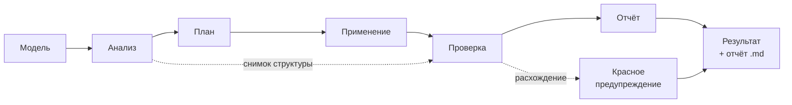

<div align="center">

# Tanyra3D

**Оптимизатор 3D-моделей для веба, который объясняет, что он сделал и почему.**

[](LICENSE)
[](https://nodejs.org/)
[](#статус)
[](#установка)

Вы кладёте `.glb`, отмечаете нужные галочки, получаете модель меньшего веса — и отчёт
человеческим языком: что нашлось, что применилось, что осталось нетронутым и по какой
причине.

**Ничего не происходит молча.**

[English version](README.md)

</div>

---

## Что это даёт на деле

Один прогон, настоящие цифры, без флагов и настроек:

```
$ node optimize2.mjs

phase 3/5 · apply · basic (8 fixes)
  • Duplicate resources (dedup)   • Vertex weld
  • Unused resources (prune)      • Degenerate triangles
  • Mesh join (flatten + join)    • Geometry compression

phase 4/5 · validation
  [baseline-validate] triangles: 7500 → 7500
  [baseline-validate] drawCalls: 1 → 1
  [baseline-validate] skins: 0 → 0    animations: 0 → 0

[DONE] Instance Grid 01.glb: file 0.95 → 0.19 MB (−80%)
```

Файл ужался впятеро. Треугольники, отрисовки, скины и анимации — все на месте, и это
не обещание, а проверка: движок сверил результат со снимком, сделанным до обработки.

---

## Чем отличается от `gltf-transform optimize`

Готовая команда `gltf-transform optimize` по умолчанию включает упрощение полигонов и
уменьшение текстур. Для каталога товаров или портфолио это неприемлемо: модель, за
которую заплатили, приходит обратно огрублённой.

Здесь два принципиальных отличия.

### Всё выключено по умолчанию

Пустой список оптимизаций означает, что файл прочитается, проверится и запишется без
единого изменения. Каждая оптимизация включается отдельно и сопровождается честным
описанием: что она делает, обратима ли, теряются ли данные, и нужен ли декодер на
стороне сайта.

### Результат проверяется, а не подразумевается

После обработки движок сверяет структуру модели со снимком, сделанным до сжатия:
треугольники, вершины, вызовы отрисовки, скины, анимации, morph-таргеты, набор
атрибутов.

Если что-то разошлось — сверху появляется **красное предупреждение** с перечислением
расхождений, и отчёт объясняет, что именно сломалось. Файл при этом всё равно
записывается и его можно скачать: решение, годится результат или нет, остаётся за
человеком.

> Молча отдать испорченную модель, поломку которой не видно на глаз, — вот чего здесь
> не бывает.

---

## Что умеет

| Оптимизация | Что делает | Потери | Нужен декодер на сайте |
|---|---|---|:---:|
| **safe** | Дедупликация материалов и текстур, удаление неиспользуемых данных и UV-каналов, сварка совпадающих вершин, вырезание вырожденных треугольников | нет | нет |
| **join** | Объединение мешей — меньше вызовов отрисовки | нет, но части перестают быть отдельными объектами | нет |
| **instance** | Повторяющиеся меши → инстансинг на видеокарте | нет | нет |
| **meshopt** | Сжатие геометрии | нет | да |
| **draco** | Сжатие геометрии, сильнее и медленнее | нет | да |
| **quantize** | Уплотнение чисел в геометрии | почти незаметные | **нет** |
| **ktx2** | Текстуры в KTX2: экономит и загрузку, и видеопамять | почти незаметные | да |
| **webp** | Текстуры в WebP | почти незаметные | нет |
| **resample** | Прореживание избыточных кадров анимации | нет | нет |
| **strip-colors** | Удаление вершинных цветов | **да**, только явным включением | нет |

Число полигонов не меняется ни одной из них — упрощение геометрии здесь отсутствует
намеренно.

<details>
<summary><b>Почему инстансинг отмечается автоматически</b></summary>

<br>

`instance` включается сам, если в модели найдена общая геометрия — несколько узлов на
один меш. Дело не только в экономии отрисовок.

`join` обязан запекать трансформ каждого узла в вершины, то есть **размножать общую
геометрию в копии**. Узлы с инстансингом он не трогает вовсе. На шахматной доске из
эталонов Khronos разница между «`join` без инстансинга» и «с ним» — **75.5 МБ против
41.0 МБ** при одинаковом результате по отрисовкам.

</details>

---

## Как это работает



Каждая оптимизация — самостоятельное правило со своими метаданными: насколько серьёзна
находка, доказуемо ли безопасно исправление, обратимо ли оно, какие данные затрагивает,
после каких других правил должно выполняться. Движок сам строит порядок и сам решает,
что применять: до уровня «незаметно глазу» включительно автоматически, потери — только
явным включением.

Ядро (`core/`) не знает про glTF. Всё, что относится к формату, живёт в аддоне
(`addons/gltf/`). Это сделано ради второго формата, а не ради красоты.

---

## Установка

Нужен [Node.js](https://nodejs.org/) 18 или новее. Работает на Windows, macOS и Linux.

```bash
git clone https://github.com/GlukerR/Tanyra3D.git && cd Tanyra3D && npm install && npm run setup
```

Это всё. `npm install` тянет всё, что ставится из npm, — включая инструмент кодирования
текстур, — а `npm run setup` докачивает браузер для тестов и проверяет остальное
окружение.

<details>
<summary><b>Что показывает <code>npm run setup</code></b></summary>

<br>

Единственное, чего npm поставить не может, — `ktx` из **KTX-Software**, отдельная
нативная программа Khronos. Скрипт печатает готовую строку под вашу систему, а не качает
чужие исполняемые файлы за вашей спиной:

- Windows — `winget install KhronosGroup.KTX-Software`
- macOS — `brew install ktx`
- Linux — пакет дистрибутива или [релизы Khronos](https://github.com/KhronosGroup/KTX-Software/releases)

Без него работает всё, кроме сжатия текстур в KTX2, и KTX2 прямо говорит, что инструмент
не найден, вместо невнятного отказа.

`npm run doctor` — перепроверить окружение, ничего не меняя.

</details>

---

## Три способа запустить

### Веб-интерфейс

```bash
npm start
```

Откроется `http://localhost:3210`. Перетащите модель, выберите платформу, отметьте
оптимизации, нажмите **«Собрать оптимизированную модель»**. Слева исходник, справа
результат, между ними — цифры
«было → стало» и отчёт. Модель проигрывается в обоих окнах одновременно, с общей
камерой и общим временем анимации.

Всё работает локально. Модели никуда не загружаются.

### Командная строка

```bash
node optimize2.mjs                          # пресет: safe + meshopt + join
node optimize2.mjs draco                    # то же, но Draco вместо Meshopt
node optimize2.mjs --keep-parts             # без объединения мешей
node optimize2.mjs --ktx2                   # добавить сжатие текстур
node optimize2.mjs --dry-run                # полный анализ и отчёт, ничего не записывая
node optimize2.mjs --passthrough            # ничего не применять, только проверить
```

Файлы берутся из `input/`, результат и отчёт `имя.report.md` кладутся в `output/`.
Обрабатывается **вся папка разом** — это и есть пакетный режим; в веб-интерфейсе модели
идут по одной.

> [!NOTE]
> В командной строке без флагов применяется пресет, а не passthrough — так сложилось
> исторически, и поведение сохранено, чтобы не ломать существующие скрипты. Программный
> интерфейс и веб-интерфейс по умолчанию не делают ничего.

### Программный интерфейс

```js
import { optimizeFile, listRules, VERSION } from './optimize2.mjs';

const result = await optimizeFile('model.glb', {
  advancedFeatures: ['safe', 'draco'],
  outDir: 'output',
});

console.log(result.status);              // 'ok' | 'fail'
console.log(result.metrics.before, result.metrics.after);
console.log(result.applied);             // что реально применилось
console.log(result.validation);          // результаты проверок
```

Полный контракт — в [`docs/ARCHITECTURE.md`](docs/ARCHITECTURE.md) §4b.

---

## Тесты

```bash
npm test
```

Тесты интеграционные: настоящие модели через настоящий пайплайн, без моков.

Часть из них открывает модель в настоящем браузере — всё нужное ставит `npm run setup`.
Без него: `npm test -- --project node`.

В репозитории лежит небольшой корпус моделей, сделанных специально для проверки —
намеренно «грязный» куб, сетка связанных дубликатов, несвязанные копии одной геометрии
без нормалей, morph-таргеты, вершинные цвета, уже сжатый вход, уже инстансированная
сцена, сцена без геометрии, файл из одних текстур, две сцены в одном файле, заведомо
битый файл. Их достаточно, чтобы набор был зелёным сразу после клонирования.

Тесты, которым нужны более тяжёлые модели, помечаются пропущенными с указанием причины —
это видно в отчёте прогона, а не растворяется.

---

## Ограничения

Честный список — то, чего программа пока не делает или делает не полностью.

- **Проверка анимаций и скинов — счётная.** Движок следит, чтобы клипы и скины не
  пропали, но не сравнивает их содержимое покадрово. Глазами сверить можно во вьюере.
- **`meshopt` на персонажах с морф-таргетами** может испортить скиннинг. Пайплайн это
  обнаруживает и помечает результат красным предупреждением — файл записывается, но
  доверять ему не стоит; используйте `draco`.
- **Размерность текстур не проверяется.** Порог платформы записан и показывается, но
  ядро пока не отдаёт ширину и высоту текстур.
- **Целевая платформа одна** — веб на three.js. Профили других площадок готовы как
  данные, но включать их рано: пока они отличались бы только подписью.
- **Пакетная обработка есть только в командной строке**, в веб-интерфейсе — по одной
  модели.

---

## Статус

**0.0.9, ранняя разработка.** Ядро, веб-интерфейс и вьюер работают, набор тестов
зелёный, публичного релиза ещё не было. API может меняться.

Ближайшее — настольное приложение с обычным установщиком вместо терминала.

Сейчас программа открывается в браузере, но это временная форма, а не замысел. Тот, для
кого она делается, не должен разбираться в сотне флажков и запускать что-то из
терминала: установил в один клик, перетащил модель, получил результат с объяснением.

---

## Зачем это всё

Небольшие студии и художники, работающие в одиночку, сталкиваются с теми же
требованиями к весу и совместимости, что и крупные команды, — но без человека, который
переведёт эти требования на понятный язык.

Этим человеком и должна быть программа.

---

## Документация

| Файл | О чём |
|---|---|
| [`docs/ARCHITECTURE.md`](docs/ARCHITECTURE.md) | устройство ядра, контракты API |
| [`docs/EXTENDING.md`](docs/EXTENDING.md) | как добавить своё правило |
| [`docs/ЗАВИСИМОСТИ.md`](docs/ЗАВИСИМОСТИ.md) | от чего зависит ядро и почему |
| [`docs/СЛОВАРЬ_формулировок.md`](docs/СЛОВАРЬ_формулировок.md) | технический термин → человеческий язык |
| [`docs/ВОПРОСЫ_И_ОТВЕТЫ.md`](docs/ВОПРОСЫ_И_ОТВЕТЫ.md) | частые вопросы |
| [`tests/TEST-MAP.md`](tests/TEST-MAP.md) | карта тестов: пять слоёв, куда класть новое |
| [`CONTRIBUTING.md`](CONTRIBUTING.md) | как участвовать |

---

## Участие

Правки приветствуются — начните с [`CONTRIBUTING.md`](CONTRIBUTING.md). Там немного:
пять принципов, каждый из которых введён после того, как его нарушение стоило времени.

## Лицензия

[Apache-2.0](LICENSE).

Модели в `fixtures/models/`, помеченные как распространяемые, сделаны автором проекта и
подпадают под ту же лицензию. Единственное исключение — `Unlinked Duplicates 01.glb`:
её геометрия это Suzanne, обезьяна-талисман из Blender; происхождение отмечено в её
`.license.md`. Остальные модели, используемые при разработке, в репозиторий не входят —
у каждой своя лицензия.
